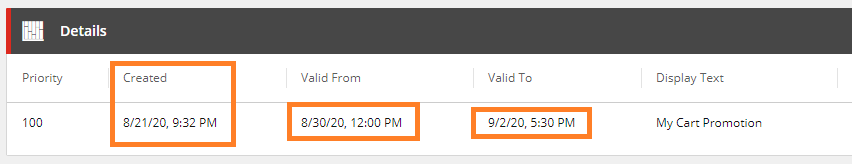

# Extended Sitecore Commerce Promotions
Custom Sitecore Commerce promotions plugin project with extended functionality for the Business Tools.

- [Supported Sitecore Experience Commerce Versions](#supported-sitecore-experience-commerce-versions)
- [Features](#features)
- [Enabling Features](#enabling-features)
- [Installation Instructions](#installation-instructions)
- [Known Issues](#known-issues)
- [Disclaimer](#disclaimer)

## Supported Sitecore Experience Commerce Versions
- XC 10.0

## Features
- [Improved Date Time Visibility for Promotions](#improved-date-time-visibility-for-promotions)

### Improved Date Time Visibility for Promotions
Updates the promotion's Details entity view to include time to **Valid To** and **Valid From** properties as promotions can change at any time throughout the day.
The **Created** date time has also been added to the details entity view as promotion prioritisation uses the **Created** date time as a fall back to settle tie-breakers.

**Enablement Policy Property:** RenderDateTimes



_Sellable Item entity view._

## Enabling Features
In the environment configuration files, add the **PromotionsFeatureEnablementPolicy** and set the desired features to `true`. (See the **Enablement Policy Property** value under each feature). For example:
```javascript
{
	"$type": "Ajsuth.Foundation.Promotions.Engine.Policies.PromotionsFeatureEnablementPolicy, Ajsuth.Foundation.Promotions.Engine",
	"RenderDateTimes": true
}
```

## Installation Instructions
1. Download the repository.
2. Add the **Ajsuth.Foundation.Promotions.Engine.csproj** to the _**Sitecore Commerce Engine**_ solution.
3. In the _**Sitecore Commerce Engine**_ project, add a reference to the **Ajsuth.Foundation.Promotions.Engine** project.
4. Enable desired features, following [Enabling Features](#enabling-features).
5. Run the _**Sitecore Commerce Engine**_ from Visual Studio or deploy the solution and run from IIS.
6. Run the **Bootstrap** command on the _**Sitecore Commerce Engine**_.
7. Restart all Commerce Engine instances.

## Known Issues
| Feature                 | Description | Issue |
| ----------------------- | ----------- | ----- |
|                         |             |       |

## Disclaimer
The code provided in this repository is sample code only. It is not intended for production usage and not endorsed by Sitecore.
Both Sitecore and the code author do not take responsibility for any issues caused as a result of using this code.
No guarantee or warranty is provided and code must be used at own risk.
